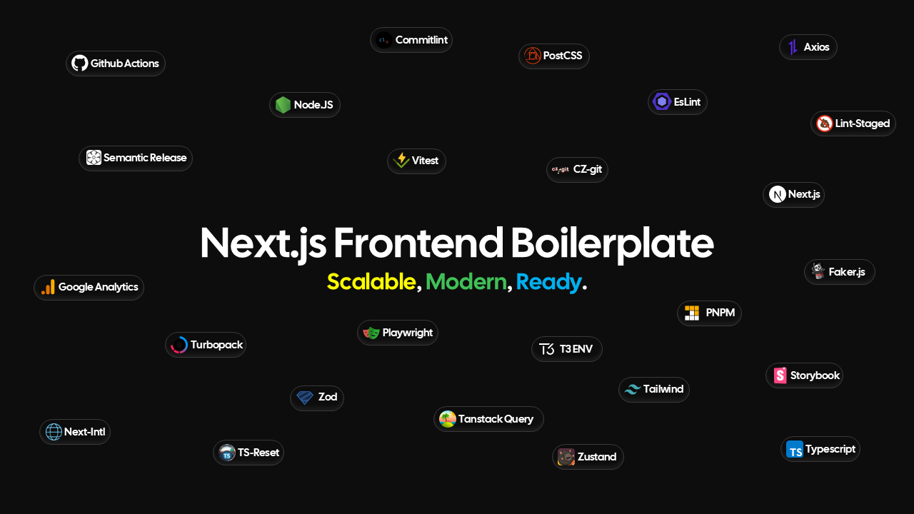

<p align="center">
  
</p>

# 🚀 Next.js Frontend Boilerplate

> A modern, batteries-included Next.js 15 frontend boilerplate designed for rapid development and scalable applications.

---

## 🎯 Features

- ⚡ **Next.js 15** with **Turbopack** support

- 🎨 UI powered by **Mantine v8**

- 🌍 Built-in Internationalization (i18n) with **Next-Intl**

- 🧪 **Vitest** for unit testing

- 🧭 **Playwright** for E2E testing

- 🧼 Strict linting via **ESLint** and **lint-staged**

- 🎨 **TailwindCSS v4** ready

- 📦 **Storybook 8** with onboarding & styling addons

- 📖 **Commitlint**, **CZ-git**, **Husky**, and **Conventional Commits** setup

- 📐 **TypeScript** + aliases + strong types

- 🗂️ Clean folder structure and **scalable architecture**

- 🧠 **Zustand** for global state management

- 🎲 **Faker.js** for mock data generation

- 🔁 **TanStack Query** for server-state caching and fetching

- 🔐 **T3 Env** for type-safe environment variables

- 🧾 **Zod** for schema validation and parsing

- ♻️ **ts-reset** to enhance the TypeScript standard library

- 🧩 **nextjs-third-parties** for simplified third-party integrations

- 🌐 Axios for powerful and flexible HTTP requests

- 📁 **Automatic generation of folders and files** when creating a new feature with the cli

---

## 🛠️ Getting Started

### 📦 Requirements

- **Node.js** ≥ 20
- **pnpm** = 10.10.0

### 🤖 Setting up GitHub actions

To be able to use GitHub actions for CI workflow, you need to create an environment in your GitHub repository. You can use the following path:

```bash
your repo > Settings > Secrets and variables > Actions > Variables(tab) > Manage environment variables > New environment
```
In CI workflow, the name assigned to the environment is `production` by default. If you want to change the name of the environment to your liking, use the name you specified when creating the environment in GitHub. To change the name of the environment locally, go to `.github\workflows\CI.yml` and change the name of the environment.

Also, check that your variable names match in the `.github\workflows\CI.yml` file:

```yaml
  env:
    NEXT_PUBLIC_BASE_API_URL: ${{ vars.NEXT_PUBLIC_BASE_API_URL }}
    NEXT_PUBLIC_APP_URL: ${{ vars.NEXT_PUBLIC_APP_URL }}
```

### 🔧 Installation

```bash
pnpm install
```

### 🏁 Run the app (with Turbopack)

```bash
pnpm dev
```

### Creating a new feature for the website

Instead of manually creating the files and folders needed for a new feature, you can use our CLI tool. Just specify the name of the feature, then select the files and folders you need. Everything will be generated automatically.

```bash
pnpm new-feature
```

## 🧪 Scripts

| Command                | Description                   |
| ---------------------- | ----------------------------- |
| `pnpm dev`             | Start dev server (Turbopack)  |
| `pnpm build`           | Build for production          |
| `pnpm lint`            | Run ESLint                    |
| `pnpm test`            | Run unit tests via Vitest     |
| `pnpm test:e2e`        | Run E2E tests with Playwright |
| `pnpm storybook`       | Launch Storybook locally      |
| `pnpm build-storybook` | Export static Storybook       |

---

## 🌍 Localization (i18n)

Powered by `next-intl`. All messages are managed inside:

```bash
src/config/i18n/messages/{locale}.json
```

---

## 🚀 Deployment

You can deploy to any Vercel-compatible platform. Just make sure to set environment variables correctly via `.env`.

---

## 🧑‍💻 Author

Made with ❤️ by [Seyed Mojtaba Shadab](https://www.shaadcode.ir)
📧 shaadcode@gmail.com
🔗 [GitHub](https://github.com/shaadcode)

---

## 📄 License

[MIT](./LICENSE)
